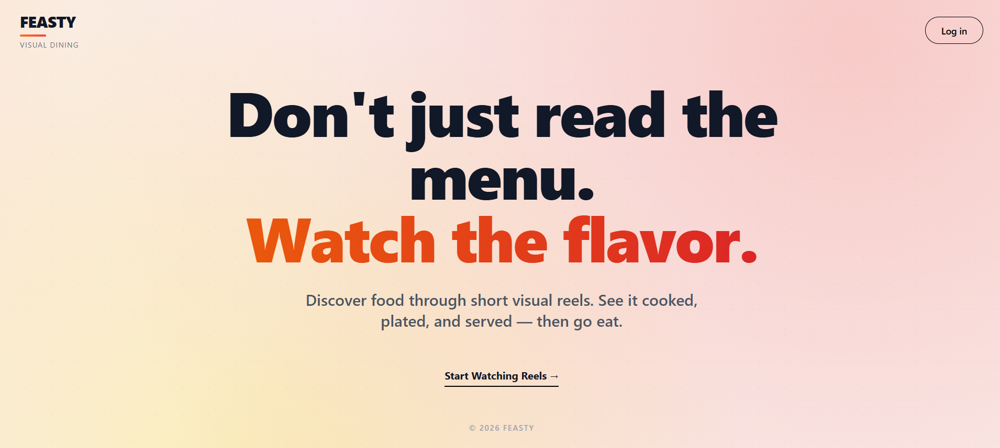
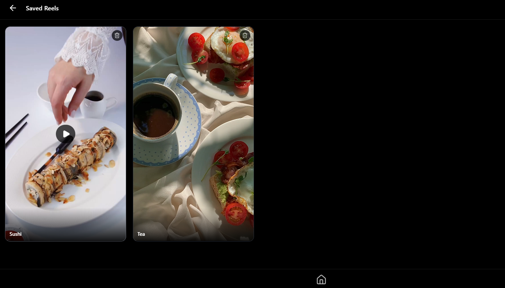

# FIESTY (F-E-A-S-T-Y)

Fiesty is a MERN stack learning project inspired by food delivery platforms, but focused on **short video reels** instead of ordering or logistics.

The primary goal of this project is to understand and implement core MERN concepts such as authentication, role separation, media handling, and client–server interaction.

This is **not a production food delivery application**.

---

## Overview

Fiesty supports two roles:

### Users
- Sign up and log in
- Watch food-related video reels
- Like reels
- Save reels for later viewing

### Food Partners
- Sign up and log in
- Upload video reels
- Add descriptions and related metadata

There is no cart, checkout, payment, or delivery workflow implemented.

---

## Tech Stack

### Frontend
- React.js
- JavaScript (ES6+)
- CSS (basic styling)

### Backend
- Node.js
- Express.js

### Database
- MongoDB
- Mongoose ODM

### Authentication
- JSON Web Tokens (JWT)
- Role-based access control (User / Food Partner)

### Media Storage
- ImageKit  
  Used for storing and serving video reels instead of local server storage.

---

## Core Features

- JWT-based authentication
- User and food partner role separation
- Secure signup and login
- Video reel upload (food partners)
- Reel feed for users
- Like functionality
- Save functionality
- RESTful API structure

---

## Screenshots

Screenshots are stored separately from application code for documentation clarity.

