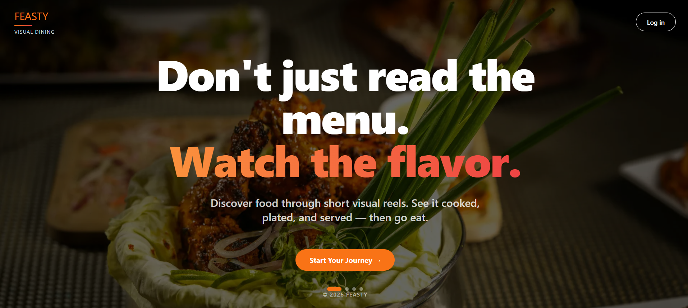
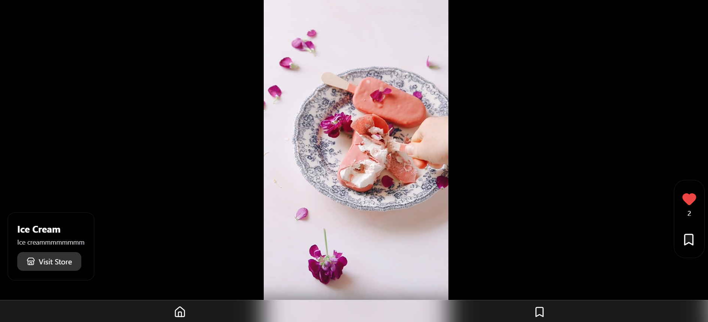
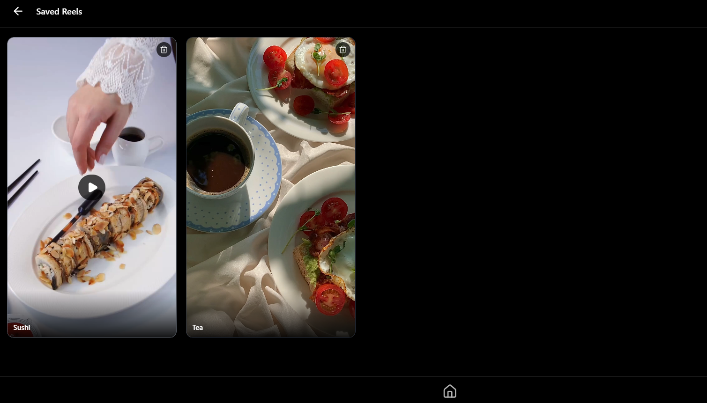

# FEASTY 🍔🎬

Feasty is a high-performance MERN stack project inspired by food delivery platforms, but focused on an immersive **short video reel experience**.

The primary goal of this project is to implement high-performance media delivery, role-based access control, and a modern, seamless user interface.

---

## 🚀 Recent Performance Optimizations

We have implemented extreme optimizations to ensure a "TikTok-like" smooth experience even on slower connections:

### 🎥 Optimized Media Delivery (ImageKit)
- **Real-time Transformations:** Videos are dynamically compressed to **480p** with a bitrate cap of **500k** for near-instant playback.
- **Aggressive Compression:** Quality is tuned for mobile screens to minimize bandwidth without sacrificing visual clarity.
- **Smart Thumbnails:** Automated JPG poster generation for instant visual feedback during buffering.

### ⚡ Advanced Reel Engine
- **Intelligent Preloading:** The app preloads the current and next two videos ahead of time.
- **Sticky Caching:** Once a video starts loading, it stays cached even when scrolling away, making re-watching instantaneous.
- **Auto-Scroll:** Seamless transition to the next reel upon completion.
- **Buffering Management:** Integrated loading states and smooth transitions for a polished feel.

---

## 🛠️ Tech Stack

### Frontend
- **React.js** (Functional Components & Hooks)
- **Tailwind CSS** (Modern utility-first styling)
- **Lucide React** (Beautiful, consistent iconography)
- **Axios** (Efficient API communication)

### Backend
- **Node.js & Express.js**
- **MongoDB & Mongoose** (Scalable data modeling)
- **JWT** (Secure, role-based authentication)

### Media Cloud
- **ImageKit.io** (Advanced real-time video transformation & CDN)

---

## ✨ Core Features

- **JWT Authentication:** Secure signup/login for both Users and Food Partners.
- **Role-Based Experience:** 
  - **Partners:** Can upload, manage, and showcase their food reels.
  - **Users:** Can discover, like, and save reels to their personal collection.
- **Glassmorphism UI:** Modern, translucent interface design.
- **Optimized Feed:** High-performance scrolling with intersection observers for autoplay.

---

## 📸 Screenshots

---

*Note: This is a learning project focused on media handling and UI/UX, not a production delivery app.*
